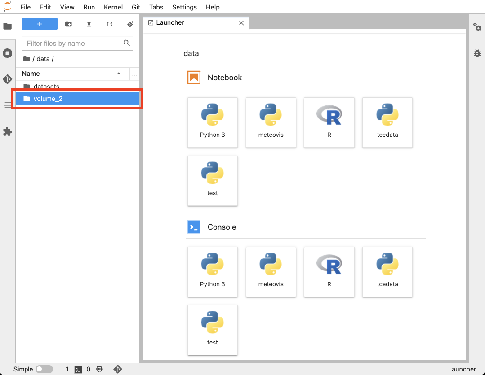

# SRC
Working guidence on SURF Research Cloud (SRC).

This document will cover some specific topics of working with SRC. For other questions, please contact the administrator in your collaboration or SURFsara Helpdesk. Otherwise, you can always read the [official documentation](https://servicedesk.surfsara.nl/wiki/display/WIKI/Research+Cloud+Documentation).

## Shared Workspaces
A scenario on SRC is to share a workspace to the other members in the same collaboration, for allowing other members to use the tools deployed on this workspace.

### Creating shareable Jupyter workspaces on SRC
1) Create a workspace based on Jupyter application. Remember to firstly create a storage and then connect that storage to your workspace.

2) Install Miniconda. Open terminal on JupyterLab and input the following shell cmd:

```shell
# cd <path/to/miniconda>
wget https://repo.anaconda.com/miniconda/Miniconda3-latest-Linux-x86_64.sh
bash Miniconda3-latest-Linux-x86_64.sh
```
Follow the instruction to finish installing Miniconda. After that, run ```conda init``` to initialize Miniconda.

3) Give full permission of ```<path/to/conda>``` to all the users

```shell
sudo chmod -R ugo+w <path/to/miniconda>
```

4) Add environment variables so that other users can also acccess conda. To do this, add the following lines in ```/etc/profile```:

```shell
export PATH=$PATH:<path/to/miniconda/bin>
export CONDA_ENVS_PATH=</path/to/miniconda/envs>
```

5) Create a conda environment and install all the packages there

```shell
conda create -n <env-name>
conda activate <env-name>
conda install <package-name>
```
For more knowledge of conda, please refer to the [official documentation](https://docs.conda.io/projects/conda/en/latest/index.html).

6) Add your conda environment to JupyterLab as a kernel. To do this, first activate your conda environment, then run the following shell cmd:

```shell
conda install ipykernel
sudo -E /path/to/miniconda/bin/python -m IPython kernel install --prefix=/usr/local --name=<kernel-name>
```

Now, all the users should be able to see the installed kernel and use it. 

7) Create a folder under ```~/data/volume_2``` and put there all the notebooks/scripts you want to share, so that other people can access those files. Then give full permission to that folder like this:

```shell
sudo chmod -R ugo+w <~/data/volume_2/your_folder>
```

The ```~/data/volume_2``` folder is actually the storage created in step 1). This folder will be mounted to the workspace and be availabe to all the users. It can also be found here: 

